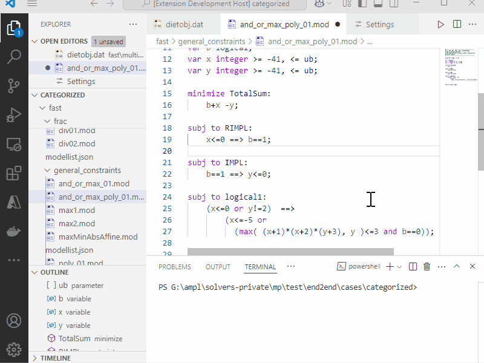
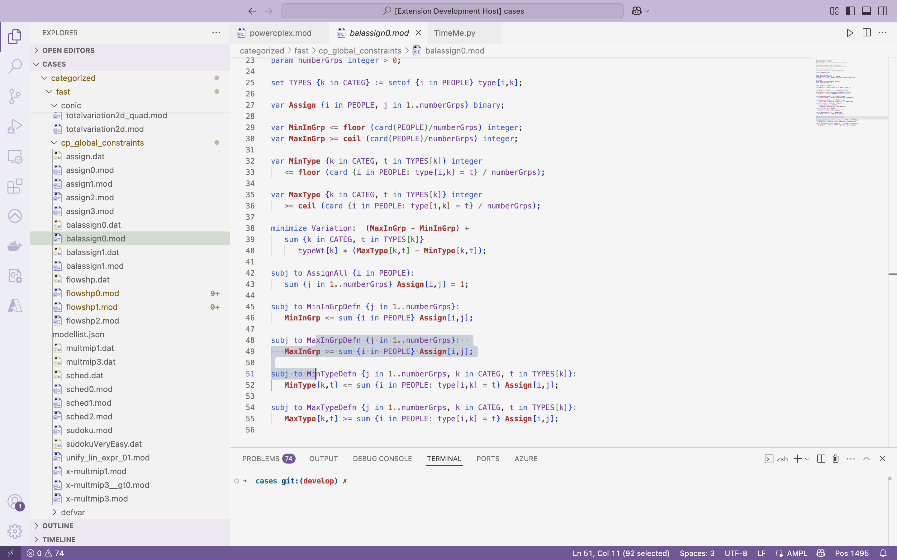
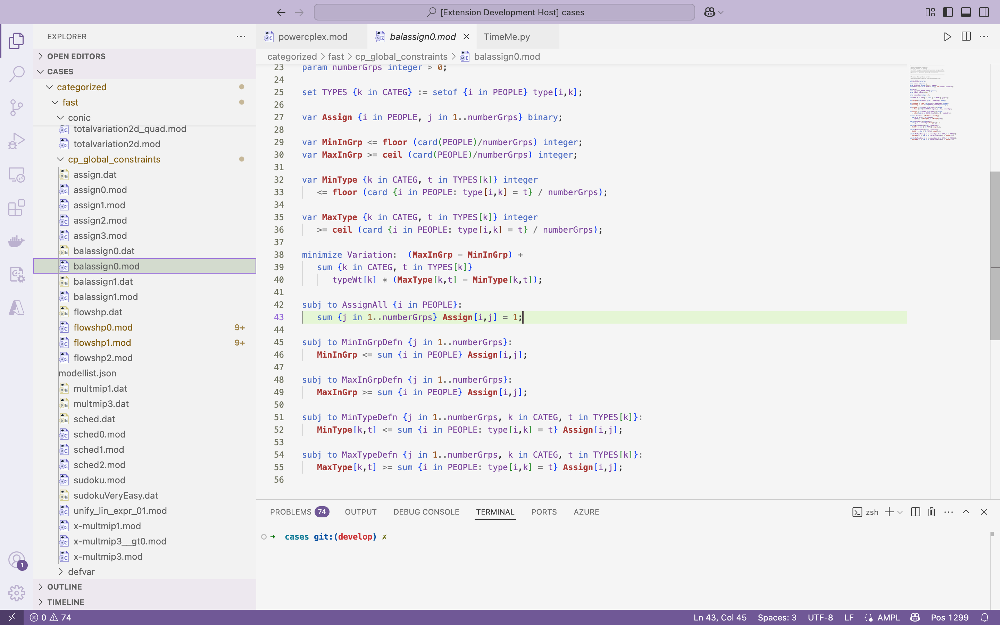
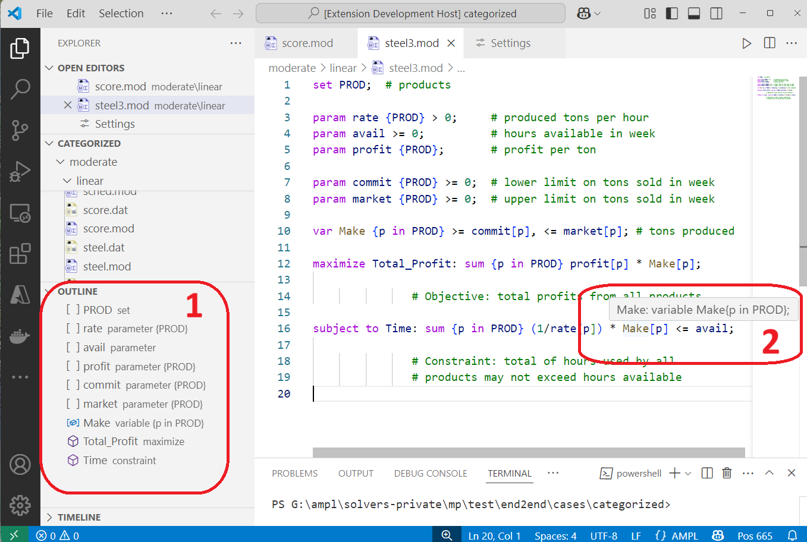
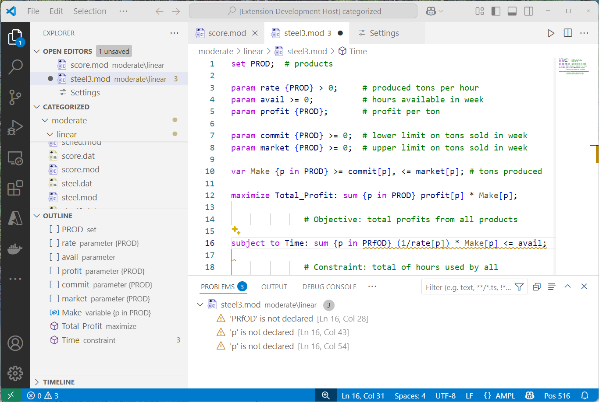
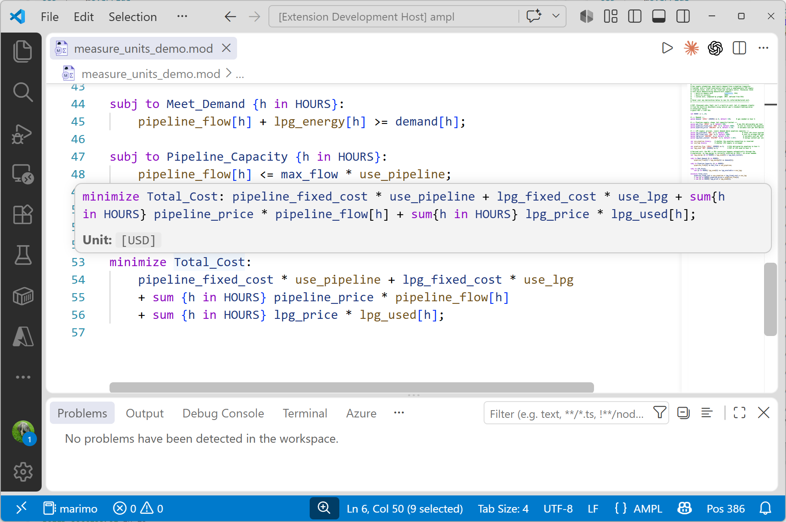

# AMPL Language support

The AMPL VS Code Extension provides language support for AMPL, including syntax highlighting and integration with the AMPL runtime.



---

## Basic Features

### 1. Syntax Highlighting
Enjoy full syntax highlighting for `.mod`, `.run`, and `.dat` files. Note that highlighting for `.dat`files is simplified, to support big file sizes. 




### 2. Autocomplete
Autocomplete for AMPL entities and for mathematical symbols `\alpha<Tab>` → `α`.

---

### 3. Run AMPL Files
Quickly run `.mod` or `.run` files directly from the editor.




### 4. Display entities and expressions
Select any entity or expression in the editor to display them in the AMPL runtime.


### 5. Streamlined keyboard shortcuts
Most used AMPL commands have keyboard shortcuts and can be accessed by the command palette:
- `run` - send current file to AMPL 
- `reset` - reset the current session
- `solve` - solve the model
- `display expression` - choose an arbitrary expression and evaluate it in AMPL

---


## Language Server Features

### 1. Multi-file support

AMPL projects often consist of several files, such as a main model file, some data files, and a script listing the files to include. This extension supports multi-file workflows: you can select a root file (the main entry point for parsing and running), and the extension will ensure that all relevant files are parsed and available to the language server. This enables features like go-to-definition, diagnostics and workspace symbols to work seamlessly across your entire project, not just the currently open file.
Use the command `AMPL: select files to parse` to choose the root file to parse; in case of multiple configurations, they can be switched to/from by `AMPL: select launch configuration`.
Use `CTRL/Cmd + P` to see and search the list of symbols in the current workspace.

### 2. Declarations support
- Hover over an entity declared in the current file (or workspace) to see its declaration
- Right click or press F12 for "go to definition"
- Tokenized syntax highlighting to support distinction for functions and variables.

### 3. Outline view
Get a list of symbols in the current file in the outline view



### 4. Diagnostics
Errors are higlighted and listed in the "Problems" window in VS code. Note that the language server is currently under development, therefore some language features might be missing; in case valid constructs are flagged as errors, please disable diagnostic.



### 5. Measure units
Attach a physical unit to a declaration by wrapping it in brackets in the alias:
```ampl
param speed '[m/s]' >= 0;
```
The language server infers units through arithmetic expressions — `param derived = speed * speed;` is automatically recognized as `[m²/s²]` — shows the result on hover, and flags dimensionally inconsistent expressions (e.g. adding a length to a time) as warnings in the Problems window.

Common SI units, major currencies (USD, EUR, GBP, JPY, CHF, CAD, AUD, CNY, including the `$ € £ ¥` symbols), and domain-specific units like the gas-industry decatherm (`Dth`) are recognized out of the box. Additional units can be defined per model with a `# @unit` comment pragma, and later pragmas can reuse units defined by earlier ones:
```ampl
# @unit USD
# @unit therm = 105505585.262 J
# @unit Dth = 10 therm
```
This feature can be turned off with the `AMPL.LanguageServer.measureUnitsEnabled` setting.



---

## Keybindings

| Command               | Keybinding (Mac)  | Keybinding (Windows/Linux) |
|-----------------------|-------------------|----------------------------|
| Run File              | `Cmd+Shift+Enter` | `Ctrl+Shift+Enter`         |
| Display Entity        | `Cmd+Shift+L`     | `Ctrl+Shift+D`             |
| Reset                 | `Cmd+Shift+R`     | `Ctrl+Shift+R`             |
| Solve                 | `Ctrl+Shift+L`    | `Ctrl+Shift+L`             |  

---

## Installation

1. Install the extension from the [VS Code Marketplace](https://marketplace.visualstudio.com/).
2. If AMPL is not on the system path, configure the path to the AMPL binary in the settings.

---

## Configuration

### Settings

| Setting                                       | Description                                                                                       |
|-----------------------------------------------|---------------------------------------------------------------------------------------------------|
| `AMPL.Runtime.pathToAMPLBinary`                       | Path to the AMPL binary. If empty, the extension will look for it in system paths.                |
| `AMPL.Runtime.changeDirectoryOnRun`                   | Change the working directory of AMPL to the directory of the file being run.                      |
| `AMPL.LanguageServer.enableLanguageServer`    | Enable or disable the language server for AMPL files.                                             |
| `AMPL.LanguageServer.trace.server`            | Trace the communication between VS Code and the AMPL language server.                             |
| `AMPL.LanguageServer.diagnosticsEnabled`      | Enable or disable error highlighting for AMPL files. Requires the language server.                |
| `AMPL.LanguageServer.measureUnitsEnabled`     | Enable or disable measure-unit inference and display (e.g. in hover) for AMPL files. Requires the language server. |
| `AMPL.Advanced.enablePsuedoTerminal`          | Enable or disable the advanced pseudoterminal. Has more features but can be unstable.             |
| `AMPL.Advanced.enableAdvancedCommands`        | Enable advanced and beta features like custom configuration and file selection commands.          |

---


## Contact us

File questions, issues, or feature requests for the extension by:
- Emailing us at [support@ampl.com](mailto:support@ampl.com)
- Filing an issue on [GitHub Issues](https://github.com/ampl/ampl-plugin-official/issues)

---

## License
This extension is licensed under the [MIT License](https://github.com/ampl/ampl-plugin-official/blob/main/LICENSE).
