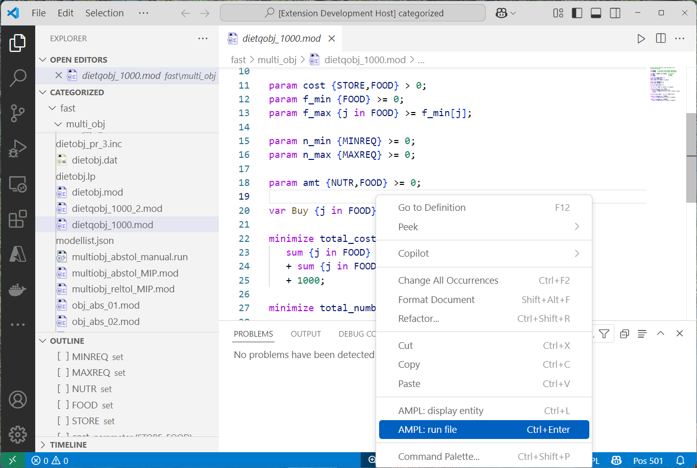

# AMPL Language support

The AMPL VS Code Extension provides language support for AMPL, including syntax highlighting and integration with the AMPL runtime.

---

## Basic Features

### 1. Syntax Highlighting
Enjoy full syntax highlighting for `.mod`, `.run`, and `.dat` files. Note that highlighting for `.dat`files is simplified, to support big file sizes. 

---

### 2. Run AMPL Files
Quickly run `.mod` or `.run` files directly from the editor.

### 3. Display entities and expressions
Select any entity or expression in the editor to display them in the AMPL runtime.

### 4. Streamlined keyboard shortcuts
Most used AMPL commands have keyboard shortcuts and can be accessed by the command palette:
- `run` - send current file to AMPL 
- `reset` - reset the current session
- `solve` - solve the model
- `display expression` - choose an arbitrary expression and evaluate it in AMPL

---

## Language Server Features

### 1. Declarations support
- Hover over an entity declared in the current file to see its declaration
- Right click or press F12 for "go to definition"
- Tokenized syntax highlighting to support distinction for functions and variables.

### 2. Outline view
Get a list of symbols in the current file in the outline view

### 3. Diagnostics
Errors are higlighted and listed in the "Problems" window in VS code. Note that the language server is currently under development, therefore some language features might be missing; in case valid constructs are flagged as errors, please disable diagnostic.

---

## Keybindings

| Command               | Keybinding (Mac)  | Keybinding (Windows/Linux) |
|-----------------------|-------------------|----------------------------|
| Run File              | `Cmd+Shift+Enter` | `Ctrl+Shift+Enter`         |
| Display Entity        | `Cmd+Shift+L`     | `Ctrl+Shift+D`             |
| Reset                 | `Cmd+Shift+R`     | `Ctrl+Shift+R`             |
| Solve                 | `Ctrl+Shift+L`    | `Ctrl+Shift+L`             |  

---

## Installation

1. Install the extension from the [VS Code Marketplace](https://marketplace.visualstudio.com/).
2. If AMPL is not on the system path, configure the path to the AMPL binary in the settings.

---

## Configuration

### Settings

| Setting                                       | Description                                                                                       |
|-----------------------------------------------|---------------------------------------------------------------------------------------------------|
| `AMPL.Runtime.pathToAMPLbinary`                       | Path to the AMPL binary. If empty, the extension will look for it in system paths.                |
| `AMPL.Runtime.pathToJRE`                              | Path to the Java Runtime Environment (min Java 11). If empty, the extension will look in the environment variable JAVA_HOME and then in the system paths. |
| `AMPL.Runtime.changeDirectoryOnRun`                   | Change the working directory of AMPL to the directory of the file being run.                      |
| `AMPL.LanguageServer.enableLanguageServer`    | Enable or disable the language server for AMPL files.                                             |
| `AMPL.LanguageServer.trace.server`            | Trace the communication between VS Code and the AMPL language server.                             |
| `AMPL.LanguageServer.diagnosticsEnabled`      | Enable or disable error highlighting for AMPL files. Requires the language server.                |
| `AMPL.Advanced.enablePsuedoTerminal`          | Enable or disable the advanced pseudoterminal. Has more features but can be unstable.             |
| `AMPL.Advanced.enableAdvancedCommands`        | Enable advanced and beta features like custom configuration and file selection commands.          |

---

## Contact us

File questions, issues, or feature requests for the extension by:
- Emailing us at [support@ampl.com](mailto:support@ampl.com)
- Filing an issue on [GitHub Issues](https://github.com/ampl/ampl-plugin-official/issues)

---

## License
This extension is licensed under the [MIT License](https://github.com/ampl/ampl-plugin-official/blob/main/LICENSE).
