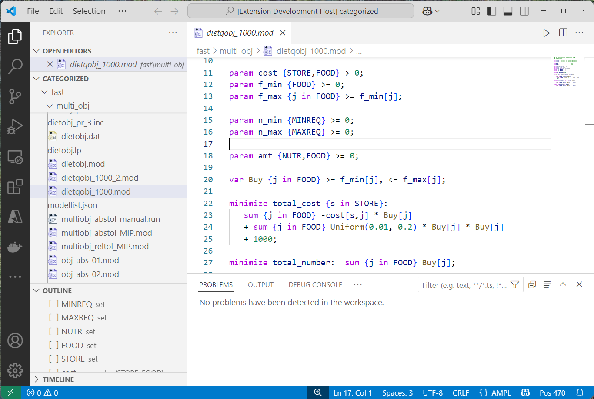

# AMPL Language support

The AMPL VS Code Extension provides language support for AMPL, including syntax highlighting and integration with the AMPL runtime. 

---

## Features

### 1. Syntax Highlighting
Enjoy full syntax highlighting for `.mod`, `.run`, and `.dat` files. Highlighting for `.dat`files is basic, to support big file sizes. 
◊

---

### 2. Run AMPL Files
Quickly run `.mod` or `.run` files directly from the editor.

---

### 3. Display entities and expressions
Select any entity or expression in the editor to display them in the AMPL runtime.

---

### 4. AMPL Language Server
Get diagnostics, outline, autocompletion, hovering support and more with the AMPL Language Server. 
Note that the language server is in beta version and some language features might be missing; in case 
valid constructs are flagged as errors, please disable diagnostic with:

---

## Keybindings

| Command               | Keybinding (Mac) | Keybinding (Windows/Linux) |
|-----------------------|------------------|----------------------------|
| Run File              | `Cmd+Enter`     | `Ctrl+Enter`               |
| Display Entity        | `Cmd+L`         | `Ctrl+L`                   |

---

## Installation

1. Install the extension from the [VS Code Marketplace](https://marketplace.visualstudio.com/).
2. Configure (AMPL is not on the system path) the path to the AMPL binary in the settings.

---

## Configuration

### Settings

| Setting                          | Description                                                                 |
|----------------------------------|-----------------------------------------------------------------------------|
| `vsampl.pathToAMPLbinary`        | Path to the AMPL binary. If empty, the extension will look for it in system paths. |
| `vsampl.changeDirectoryOnRun`    | Change the working directory of AMPL to the directory of the file being run. |
| `vsampl.diagnosticsEnabled`      | Enable or disable diagnostic from the language server                       |

---

## Contact us

File questions, issues, or feature requests for the extension by:
- Emailing us at [support@ampl.com](mailto:support@ampl.com)
- Filing an issue on [GitHub Issues](https://github.com/ampl/ampl-plugin-official/issues)

---

## License
This extension is licensed under the [MIT License](https://github.com/ampl/ampl-plugin-official/blob/main/LICENSE).
